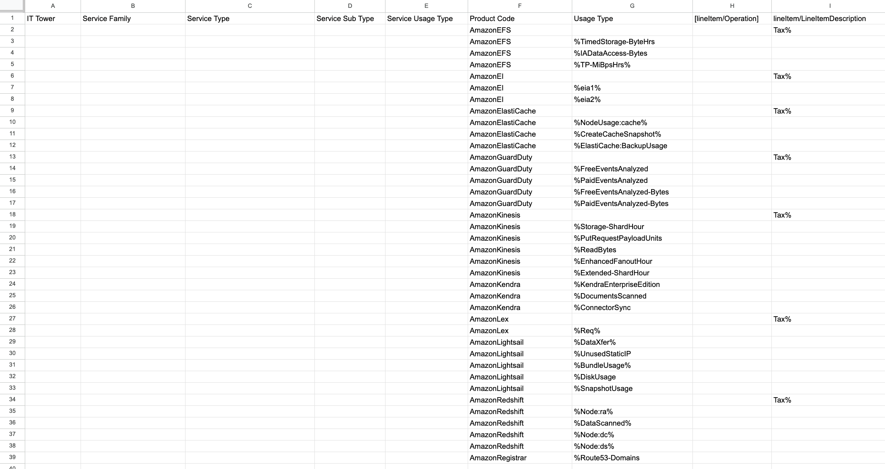
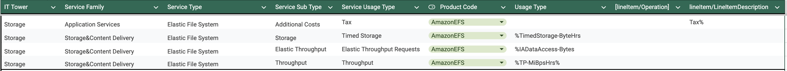
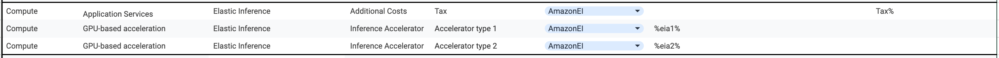
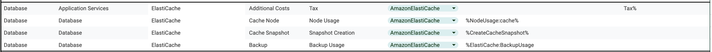
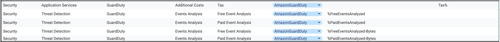
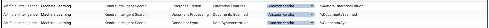
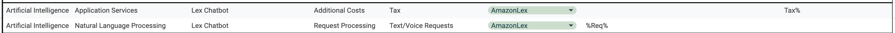
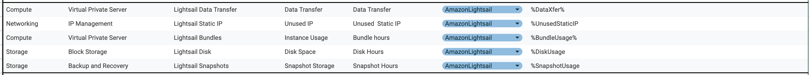
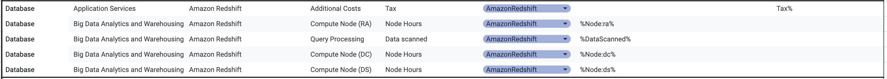
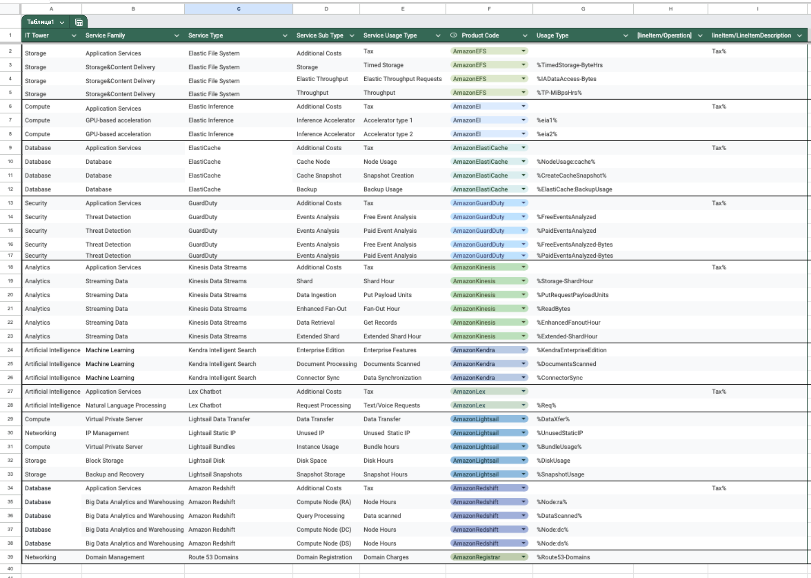

Выполнила: Данилова Анастасия Алексеевна

Вариант: 6

## Лабораторная работа 1. Знакомство с IaaS, PaaS, SaaS сервисами в облаке на примере Amazon Web Services (AWS). Создание сервисной модели.

### Дано: 
1. Слепок данных биллинга от провайдера после небольшой обработки в виде SQL-параметров. Символ % в начале/конце означает, что перед/после него может стоять любой набор символов.
2. Образец итогового соответствия, что желательно получить в конце.

### Необходимо: 
1. Импортировать файл .csv в Excel или любую другую программу работы с таблицами. Для Excel делается на вкладке Данные – Из текстового / csv файла – выбрать файл, разделитель – точка с запятой.
2. Распределить потребление сервисов по иерархии, чтобы можно было провести анализ от большего к меньшему (напр. От всех вычислительных ресурсов Compute дойти до конкретного типа использования - Выделенной стойка в датацентре Dedicated host usage).

***Алгоритм работы***: Сопоставить входящие данные от провайдера с его же документацией. Написать в соответствие колонкам справа значения 5 колонок слева, которые бы однозначно классифицировали тип сервиса. Для столбцов IT Tower и Service Family значения можно выбрать из образца.

### 1. Исходные данные

### Изучение полученных данных

Составим сводку информации по каждому продукту:

**AmazonEFS** - Amazon Elastic File System (Amazon EFS) предоставляет полностью автономное файловое хранилище Elastic, позволяющее обмениваться файловыми данными без выделения ресурсов и управления емкостью и производительностью хранилища. Amazon EFS позволяет масштабироваться по требованию до петабайт без сбоев в работе приложений, автоматически увеличиваясь и сокращаясь по мере добавления и удаления файлов. 

***исходя из этой информации и изучения видов использванияи операций заполним таблицу для Amazon EFS:***

**AmazonEI** - Amazon Elastic Inference (EI) — это сервис от компании Amazon, который позволяет присоединять недорогое ускорение на базе графического процессора к задачам Amazon EC2, Amazon SageMaker или Amazon Elastic Container Service (ECS)

***исходя из этой информации и изучения видов использванияи операций заполним таблицу для Amazon EI:***

**AmazonElastiCache** - Amazon ElastiCache — это полностью управляемое хранилище данных и служба кэша в памяти от Amazon Web Services (AWS). Сервис улучшает производительность веб-приложений, получая информацию из управляемых кэшей в памяти, вместо того чтобы полностью полагаться на более медленные базы данных на основе дисков.

***исходя из этой информации и изучения видов использванияи операций заполним таблицу для Amazon ElastiCache:***

**AmazonGuardDuty** - Amazon GuardDuty — это сервис непрерывного мониторинга безопасности, который анализирует и обрабатывает различные источники данных, включая логи потоков VPC, журналы событий AWS CloudTrail и DNS.

***исходя из этой информации и изучения видов использванияи операций заполним таблицу для Amazon GuardDuty:***

**AmazonKinesis** - Amazon Kinesis — это сервис аналитики данных от Amazon Web Services, который представляет собой полностью управляемую и масштабируемую платформу для потоковых приложений на AWS.

Он помогает в сборе, обработке и анализе потоковых данных в реальном времени для получения своевременных выводов и более быстрого реагирования на новую информацию. 

Некоторые возможности Amazon Kinesis:

Полностью управляемый. Запускает потоковые приложения, не требуя управления инфраструктурой. 
Эластичная масштабируемость. Гарантирует обработку потоковых данных из десятков тысяч источников с очень малыми задержками. 
Долговечность. Почти сразу после добавления данных приложение Kinesis может начать использовать содержимое потока. 
Безопасность. Шифрование на стороне сервера и защита при хранении с помощью главных ключей AWS KMS. 

***исходя из этой информации и изучения видов использванияи операций заполним таблицу для Kinesis Data Streams:***

**AmazonKendra** - Amazon Kendra — это пользовательский сервис поиска и аналитики на основе машинного обучения, предлагаемый Amazon Web Services (AWS). Он помогает организациям быстро и эффективно индексировать и искать данные из всех типов источников. 

Сервис использует передовые методы, такие как обработка естественного языка и компьютерное зрение, чтобы понимать и обрабатывать запросы пользователей и предоставлять точные, релевантные результаты. 

***исходя из этой информации и изучения видов использванияи операций заполним таблицу для Kendra Intelligent Search:***

**AmazonLex** - это сервис от Amazon Web Services (AWS), который позволяет разработчикам создавать разговорные интерфейсы или чатботов для своих приложений с помощью голоса и текста. 

Он предоставляет функции автоматического распознавания речи (ASR) для преобразования голоса в текст и понимания естественного языка (NLU) для определения цели текста.

***исходя из этой информации и изучения видов использванияи операций заполним таблицу для Lex Chatbot:***

**AmazonLightsail** - Amazon Lightsail — это облачная платформа, которая предлагает экземпляры виртуальных частных серверов (VPS), контейнеры, хранилище и управляемые базы данных по экономичной и предсказуемой ежемесячной цене. 

***исходя из этой информации и изучения видов использванияи операций заполним таблицу для Amazon Light ail:***

**AmazonRedshift** - Amazon Redshift — это быстрый и мощный облачный сервис для хранения и анализа больших объёмов данных. Он позволяет легко и доступно анализировать данные с помощью уже имеющихся инструментов бизнес-аналитики. 

***исходя из этой информации и изучения видов использванияи операций заполним таблицу для Amazon Redshift:***

**AmazonRegistrar** - AmazonRegistrar — это сервис для эффективного управления трафиком доменных имён, направляя его к приложениям и внутренним ресурсам. 2

Он предоставляет удобные и надёжные инструменты для регистрации и управления доменами, обеспечивая высокий уровень управляемости и надёжности в этом процессе.

***исходя из этой информации и изучения видов использванияи операций заполним таблицу для Amazon Registrar:***

# Результат

В итоге получаем что-то такое:

[открыть можно по клику тут](https://docs.google.com/spreadsheets/d/1PXYzj1KEza59JsxuLbOY9BH5t1WjDmgDt3q8SqWZ7Zg/edit?usp=sharing)

## Вывод

При выполнении этой лабораторной работы я больше узнала про AWS и его продукты. Оказалось, что у этого сервиса куда больше категорий и видов услуг чем я предполагала.

Я поняла, что что тут нельзя придумать строгую классификацию для каждого сервиса и от ресурса к ресурсу они разнятся, так что для лучшего понимания принципа того или иного проудкта очень полезно внимательно ознакомиться с тем, что он из себя представляет.

Также я узнала, что каждый продукт предоставляет очень много вариаций работы с ним и от вида к виду может казаться что это вообще разные продукты а не возможности одного.