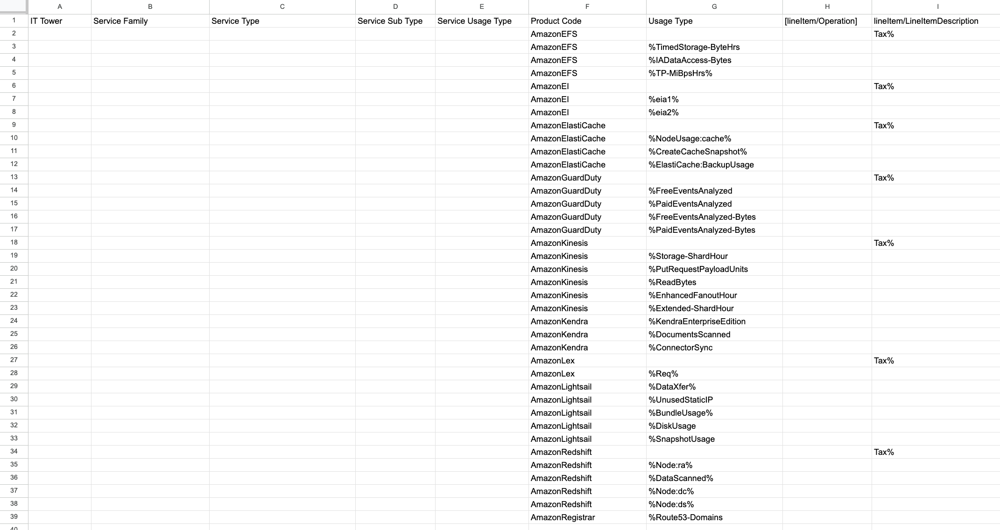
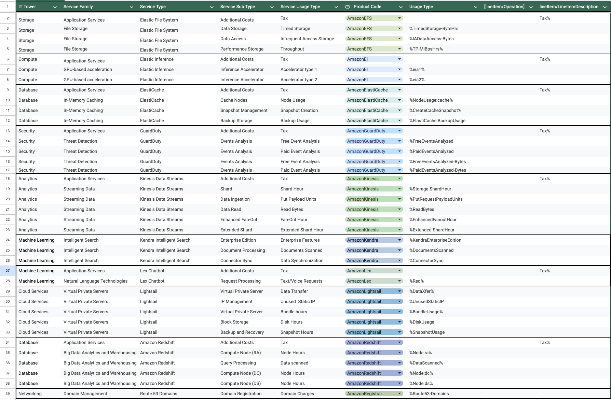

Выполнила: Данилова Анастасия Алексеевна

Вариант: 6

## Лабораторная работа 1. Знакомство с IaaS, PaaS, SaaS сервисами в облаке на примере Amazon Web Services (AWS). Создание сервисной модели.

### Дано:

1. Слепок данных биллинга от провайдера после небольшой обработки в виде SQL-параметров. Символ % в начале/конце означает, что перед/после него может стоять любой набор символов.
2. Образец итогового соответствия, что желательно получить в конце.

### Необходимо:

1. Импортировать файл .csv в Excel или любую другую программу работы с таблицами. Для Excel делается на вкладке Данные – Из текстового / csv файла – выбрать файл, разделитель – точка с запятой.
2. Распределить потребление сервисов по иерархии, чтобы можно было провести анализ от большего к меньшему (напр. От всех вычислительных ресурсов Compute дойти до конкретного типа использования - Выделенной стойка в датацентре Dedicated host usage).

**_Алгоритм работы_**: Сопоставить входящие данные от провайдера с его же документацией. Написать в соответствие колонкам справа значения 5 колонок слева, которые бы однозначно классифицировали тип сервиса. Для столбцов IT Tower и Service Family значения можно выбрать из образца.

### 1. Исходные данные

### Изучение полученных данных

Составим сводку информации по каждому продукту:

**AmazonEFS**

Amazon Elastic File System - это облачный сервис для хранеия файлов. Его главное преимущество гибкость (**elastic** file system) - он увеличивается и сокращается по мере добавления и удаления файлов. А еще например из его достоинств можно назвать эффективность, безопасность(e. g. поддерживает шифрование) и надежность(поддержка периодических резервных копий).

**AmazonEI**

Amazon Elastic Inference (EI) — это сервис, который позволяет присоединять недорогое ускорение на базе графического процессора к задачам Amazon EC2, Amazon SageMaker или Amazon Elastic Container Service (ECS).

**AmazonElastiCache**

Amazon ElastiCache — это сервис для хранения данных и служб кэша в памяти. Получая данные из кешей в памити, он улучшает производительность веб-приложений.

**AmazonGuardDuty**

Amazon GuardDuty — это сервис мониторинга и обнаружения угроз. Он отслеживает любие виды подозрительного поведения с целью защиты аккаунтов AWS.

**AmazonKinesis**

Amazon Kinesis — это сервис предназначенный для анализа и обработки различных потоков данных в реальном времени и больших масштабах.

**AmazonKendra**

Amazon Kendra — это сервис интеллектуального поиска на базе машинного обучения.

**AmazonLex**
Amazon Lex - это сервис который помогает разработчикам создавать разговорные интерфейсы или чатботов, предоставляя функции автоматического распознавания речи и понимания естественного языка.

**AmazonLightsail**

Amazon Lightsail — это сервис, предоставляющий экземпляры виртуальных частных серверов, контейнеры, хранилище и управляемые БД.

**AmazonRedshift**

Amazon Redshift — это сервис для хранения и анализа больших объёмов данных.

**AmazonRegistrar**

Amazon Registrar — это сервис регистрации и управления доменами.

# Результат

В итоге получаем что-то такое:

[открыть можно по клику тут](https://docs.google.com/spreadsheets/d/1PXYzj1KEza59JsxuLbOY9BH5t1WjDmgDt3q8SqWZ7Zg/edit?usp=sharing)

## Вывод

При выполнении этой лабораторной работы я больше узнала про AWS и его продукты. Оказалось, что у этого сервиса куда больше категорий и видов услуг чем я предполагала.

Я поняла, что что тут нельзя придумать строгую классификацию для каждого сервиса и от ресурса к ресурсу они разнятся, так что для лучшего понимания принципа того или иного проудкта очень полезно внимательно ознакомиться с тем, что он из себя представляет.

Также я узнала, что каждый продукт предоставляет очень много вариаций работы с ним и от вида к виду может казаться что это вообще разные продукты а не возможности одного.
