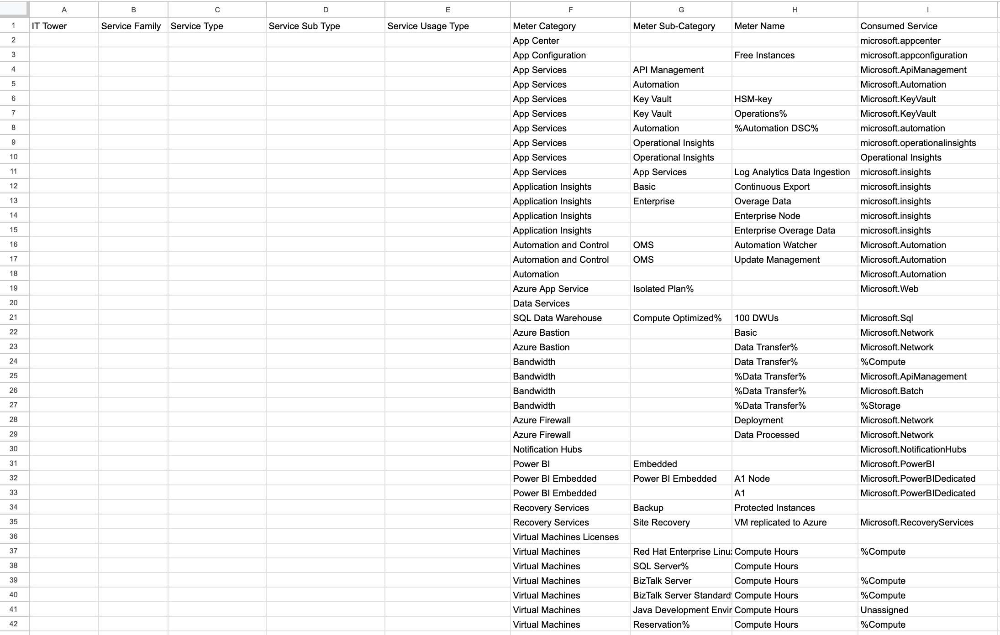
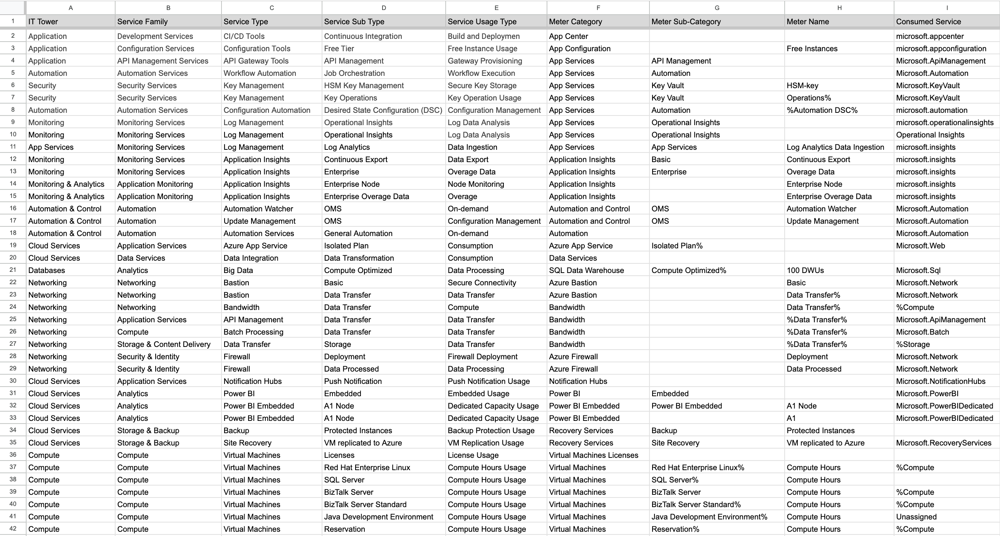

Выполнила: Данилова Анастасия Алексеевна

Вариант: 6

## Лабораторная работа 2. Сравнение сервисов Amazon Web Services и Microsoft Azure. Создание единой кросс-провайдерной сервисной модели.

## Цель работы:

Получение навыков аналитики и понимания спектра публичных облачных сервисов без привязки к вендору. Формирование у студентов комплексного видения Облака.

## Дано:

- Данные лабораторной работы 1.

- Слепок данных биллинга от провайдера после небольшой обработки в виде SQL-параметров. Символ % в начале/конце означает, что перед/после него может стоять любой набор символов.

- Образец итогового соответствия, что желательно получить в конце.

## Необходимо:

1. Импортировать файл .csv в Excel или любую другую программу работы с таблицами. Для Excel делается на вкладке Данные – Из текстового / csv файла – выбрать файл, разделитель – точка с запятой.
2. Распределить потребление сервисов по иерархии, чтобы можно было провести анализ от большего к меньшему (напр. От всех вычислительных ресурсов Compute дойти до конкретного типа использования - Выделенной стойка в датацентре Dedicated host usage). При этом сохранять логическую концепцию, выработанную в Лабораторной работе 1.

**Алгоритм работы**: Сопоставить входящие данные от провайдера с его же документацией. Написать в соответствие колонкам справа значения 5 колонок слева, которые бы однозначно классифицировали тип сервиса. Для столбцов IT Tower и Service Family значения можно выбрать из образца. В ходе выполнения работы не отходить от принципов классификации, выбранных в Лабораторной работе 1. Например, если сервис Машинного обучения был разбит на Вычислительные мощности и Облачные сервисы, то продолжать его разбивать и в новых данных.

# Вариант 6:

## Разберем по отдельности каждый продукт

### **App Center**

Visual Studio App Center — это сервис для создания, тестирования, распространения, отслеживания и поддержки приложений для iOS, Android,Windows и других платформ.

### **App Configuration**

Azure App Configuration - это сервис для централизованного управления настройками приложений и флагов функций в облаке. С его помощью можно отделить конфигурации от самого кода, а это способствует лучшей читаемотсти, удобству сопровождения и поддержке.

### **App Service**

Azure App Service - это сервис быстрого и легкого создания мобильных и веб-приложений и их развертывания благодаря удобной, надежной и безопасной облачной инфраструктуре.

### **Application Insights**

Azure Application Insights - это сервис для DevOps разработчиков, позволяющий отслеживать и оптимизировать производительность и надежность своих приложений.

### **Automation**

Azure Automation - это сервис предназначенный для автоматизации и оптимизации различных задач управления в среде Azure. Он предлагает разработчикам набор инструментов уменьшающих ручной контроль и повышающих производительность проекта. Например он предлагает автоматизацию обновлений, развертываний, а также набор процедур runbooks, содержащий в себе коллекцию скриптов, автоматизирующих некоторые рабочие процессы (e. g. развертывание, подготовка и управление различными ресурсами)

### **Data Services**

Azure Data Services - это набор сервисов Azure для работы с разного вида данными. Например есть сервисы для работы с большими неструктурированными или полуструктурированными данными, платформы для разработки моделей машинного обучения, бизнеса, баз данных и тд.

### **SQL Data Warehouse**

Azure SQL Data Warehouse - это сервис для хранения данных. Предназначен для обработки больших обьемов данных и аналитики.

### **Azure Bastion**

Azure Bastion - это сервис предназначенный для подключения к виртуальным машинам с помощью браузера из поратала Azure и обеспечивающий безопасное и бесперебойное подключение к ней по RDP/SSH

### **Bandwidth**

Azure Bandwidth - это сервис для передачи данных _из центров_/ _в центры_ обработки данных Azure, а также между ними.

### **Azure Firewall**

Azure Firewall - это сервис обеспечения безопасности сети, защищающая ресурсы виртуальной сети Azure анализируя угрозы, проверяя безопасность трафика и интегрируясь с другими сервисами мониторинга.

### **Notification Hubs**

Azure Notification Hubs - это масштабируемый сервис мобильных push-уведомлений. Он позволяет отправлять уведомления на устройства iOS, Android, Windows и других.

### **Power BI**

Объединение Azure и Power BI позволяет визуализировать данные Azure, генерировать отчеты, панели управления и получать информацию в реальном времени. То есть их симбиоз предоставляет возможности анализа данных любого размера, внеднение визуализаций и использование возможностей ИИ и машинного обучения

### **Recovery Services**

Azure Recovery Services - это сервис резервоного копирования, восстановления после сбоев и сохранения данных

### **Virtual Machines**

Azure Virtual Machines - это сервис позволяющий создавать и запускать виртуальные машины в облаке.

### Изучив каждый из сервисов, составим таблицу по аналогии с таблицей 1 лабораторной:

# Результат:

[открыть можно по клику тут](https://docs.google.com/spreadsheets/d/1N38GtifsS27xnqr2zfxlBFZjB6RRXDIdrOUuCEnRaUs/edit?usp=sharing)

# Вывод:

Выполяя данную лабораторную работу, я примерно уже понимала после AWS, что у Azure тоже будет очень много проудктов, их ответвлений и возможностей взаимодействия с ними. Но была удивлена, что Azure окажется более запутанным и ответвленным по своим классификациям.

Если делать вывод относительно преимуществ сервисов и того, кого же из них выбрать, то я бы сказала, что Azure больше подойдёт пользователям Windows и экосистемы Microsoft, удобно интегрируясь в эту инфраструктуру. AWS же более гибкий и хорошо подходит для множества различных интеграций
