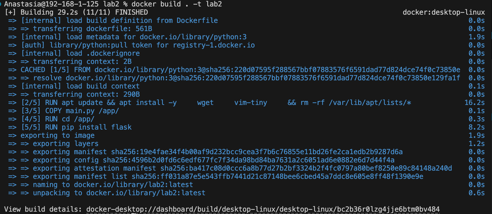
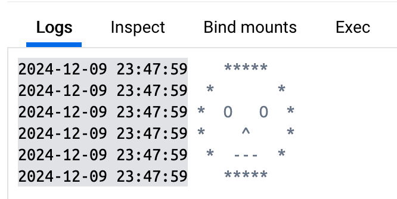
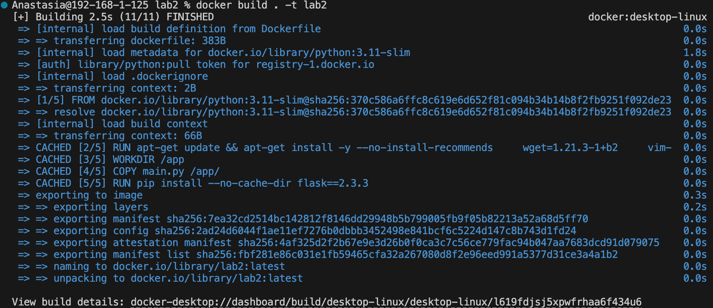

Выполнила: Данилова Анастасия Алексеевна

# Docker
Для начала скачала приложение Docker, затем установила расширение для него в IDE и создала простой файлик с кодом на питоне, который выводит смайлик. В docker файле я установила базовый образ для контейнера в виде питона. Затем обновила список пакетов и установила пакеты wget vim-tiny. Рабочей директорией сделала app, куда и скопировала main.py следующим действием. Предпоследним действием установила через pip билбиотеку flask. Ну и в самом конце определила команду, которая будет выполняться при старте контейнера исполняя файл main.py
## "Плохой" и "Хороший" Dockerfile.
### "Плохой" Dockerfile:

#### Код:
```Docker
FROM python:3

RUN apt update && apt install -y \
    wget \
    vim-tiny \
    && rm -rf /var/lib/apt/lists/*

COPY main.py /app/

RUN cd /app/

RUN pip install flask

CMD ["python", "/app/main.py"]
```

#### Скрины билда и запуска:
Build "плохого" контейнера:


Запуск "плохого" контейнера(у исправленного запуск будет аналогичный):

#### Перейдем к разбору плохих практик:
```Docker
FROM python:3
```
В этой строке я не указала конкретную версию питона, это черевато тем, что докер будет устанавливать поледнюю версию, что может вызвать непредсказвемое поведение проекта, например из-за того, что какие-то библиотеки не будут уже совместимы с ```latest``` версией.

```Docker
RUN apt update && apt install -y \
    wget \
    vim-tiny \
    && rm -rf /var/lib/apt/lists/*
```

1. **```apt``` вместо ```apt-get```.**
   Интерфейс ```apt``` не гарантируется дистрибутивами Linux для разных версий. Поэтому лучше использовать ```apt-get``` или ```apt-cache```, которые более стабильны.
2.  **```--no-install-recommend```.**
   Без флажка ```--no-install-recommended```,  устанавливаются все рекомендуемые пакеты для проекта и сам пакет. Это может привести к увеличению конечного размера образа Docker за счет установки ненужных пакетов. 
3. **Опять не указаны версии установки ```wget``` и ```vim-tiny```.** Это также ведет к риску несовместимости версий и непредсказуемому поведению как в первой строке.
4. **```apt-get cache```**
   Удаление кэша apt-get уменьшает конечный размер изображения и не добавляет в конечное изображение еще один слой.


Использование 
```Docker
RUN cd /app/
``` 
вместо 
```Docker
WORKDIR /app
```
Каждая команда ```RUN``` добавляет новый слой и состояние этой команды не сохраняется для последующих слоев, то есть далее придется каждый раз в новой команде прописывать путь заново, дублируя код, что как раз можно увидеть в ```CMD```, где ришлось заново указывать переход в папку app.

```Docker
RUN pip install flask
``` 
  опять не указана версия, писала выше чем это плохо. Также не прописан флаг ```--no-cache-dir```, который предотвращает сохранение кэш-файлов создаваемых во время установки. Использование этого флага уменьшает итоговый объем докер образа. Также уменьшение количества временных файлов снижает риск утечки информации (например, URL-адресов для приватных пакетов, токенов и других данных, которые могут быть сохранены в кэше).

### Исправленный Dockerfile:

#### Код:
```Docker
FROM python:3.11-slim


RUN apt-get update && apt-get install -y --no-install-recommends \
    wget=1.21.3-1+b2 \
    vim-tiny=2:9.0.1378-2 \
    && rm -rf /var/lib/apt/lists/* \
    && apt-get clean


WORKDIR /app

COPY main.py /app/

RUN pip install --no-cache-dir flask==2.3.3

CMD ["python", "main.py"]

```
Я использовала образ python:3.11-slim, который является легковесной версией Python 3.11. Это уменьшило итоговый размер контейнера и снизило вероятность включения ненужных компонентов.

#### Build контейнера:


Как можно увидеть, даже по времени билда "плохой" докер файл сильно проигрывает "хорошему". У первого время билда составило 29.2 секунды, а у второго 2.5 секунды. Этому причиной использование более тяжелого образа питона, не оптимизированная установка пакетов через ```apt```, отсутствие точных версий пакетов, так как ```apt``` и ```pip``` приходится делать дополнительынй запрос для поиска последних версий, отсутствие удаления кэша и создания лишних слоев лишней командой ```RUN``` вместо ```WORKDIR```. 
По памяти очевидно первый вариант также и весит неоправданно больше.


## Плохие практики работы с Контейнерами

1. **Использование Docker в качестве CI/CD**. Dockerfile предназначен для описания и создания контейнеров, а не их тестирования/сборки и тд. Также это нарушает принцип разделения обязанностей, смешивая создание контейнера и его сборку. Плюс это усложняет отслеживание и управление процессами так как описание CI/CD в Dockerfile очень сильно усложнит код так как докер не поддерживает стандартные инструменты CI/CD, а это усложняет поддержку кода.
2. **Создание непрозрачных файлов Docker**. Непрозрачные докер-файлы это такие файлы, которые сложны для понимания, сопровождения и диагностики. Их поведение может быть непредсказуемым, у них может быть затруднена отладка, поддержка, могут из-за своих нагромождений съедать излишюю память. Такой практики стоит избегать, так как любая работа с такими файлами будет неоправданно усложнена как автору такого файла, так и другим разработчиком.