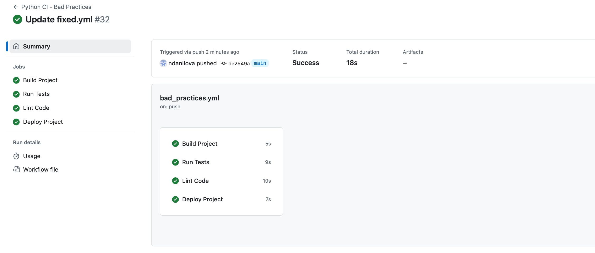
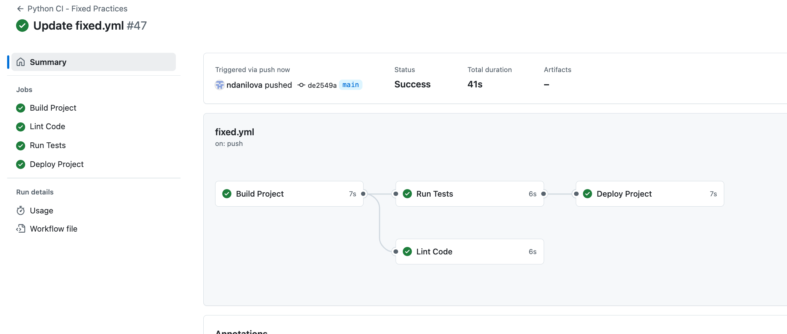
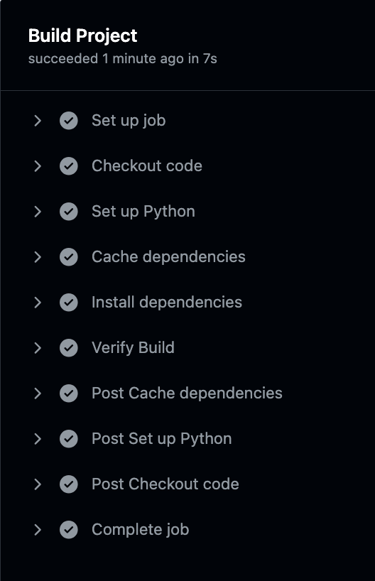
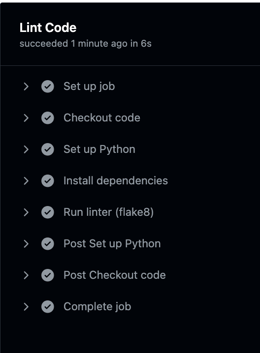
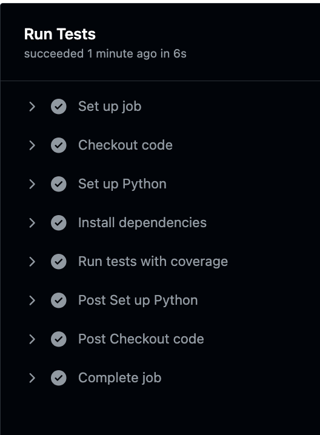
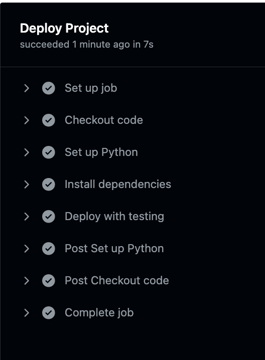

Выполнила: Данилова Анастасия Алексеевна

# CI / CD

Я создала простой файлик на питоне из задачек по алгосам и написала к нему 8 тестов. В Github Actions начала писать файл bad_practices.yml:

## "Плохой" CI / CD

### 1. Запуск сборки без ограничения по веткам
```YML
name: Python CI - Bad Practices

defaults:
  run:
    working-directory: ./devops/lab3

on:
  push:
    branches: # запуск сборки без ограничения по веткам
      - '*'
  pull_request:
    branches:
      - '*'
```
Здесь плохая практика заключается в том, что на запуск сборки не поставлено ограничений по условиям. То есть при любых изменениях на какой-нибудь тестовой или даже неактивной ветке будет запускаться сборка, растрачивая ресурсы и время.


### 2. Отсутствие кэширования зависимостей
Для ускорения выаолнения пайплайна и во имя избегания лишнего времени на повторные установки зависимостей хороший тон использовать кэширование, чего здесь не наблюдается


```YML
jobs:
  build:
    name: Build Project
    runs-on: ubuntu-latest
    steps:
      - name: Checkout code
        uses: actions/checkout@v3

      - name: Set up Python
        uses: actions/setup-python@v4
        with:
          python-version: '3.10'

      # установка зависимостей без использования кэша
      - name: Install dependencies
        run: |
          python -m pip install --upgrade pip
          pip install -r requirements.txt
      - name: Verify Build
        run: |
          echo "Build successful"
  ```

  ### 3. Отсутствие зависимости между build и test

  Если не указвать зависимость test от build, то даже при неуспешном завершении билда начнется тестирование, что не есть хорошо. Если не сработал билд, то тестированию уже нет смысла начинаться.
  ```YML        
  test:
    name: Run Tests
    runs-on: ubuntu-latest
    # отсутствие зависимости между задачами build и test
    steps:
      - name: Checkout code
        uses: actions/checkout@v3

      - name: Set up Python
        uses: actions/setup-python@v4
        with:
          python-version: '3.10'
```


### 4. Запуск тестов без результатов покрытия

без указания у ```pytest``` ```--cov``` тестирование будет запускаться без покрытия, что ограничивает возможности мониторинга качества кода.
```YML 
      # установка зависимости без использования кэша (дублирование кода)
      - name: Install dependencies
        run: |
          python -m pip install --upgrade pip
          pip install -r requirements.txt
      # запуск тестов без результатов покрытия
      - name: Run tests without coverage
        run: pytest tests/
```


### 5. Отсутствие линтинга
Линтинг позволяет анализировать стиль и качество кода, искать потенциальные ошибки. Без него есть риск получить непроверенный код с ошибками или плохим форматированием/стилистикой.

```YML 
  lint:
    name: Lint Code
    runs-on: ubuntu-latest
    steps:
      - name: Checkout code
        uses: actions/checkout@v3

      - name: Set up Python
        uses: actions/setup-python@v4
        with:
          python-version: '3.10'

      - name: Install dependencies
        run: |
          python -m pip install --upgrade pip
          pip install -r requirements.txt
      # отсутствие статического анализа кода (линтинга)
      - name: Lint without static analysis
        run: |
          echo "Linting not performed"
  ```


  ### 6. Развертывание без тестирования
  Развертывание проекта без предварительного тестирования может привести к ошибкам в продакшене, если код не прошел все проверки. Так что хороший тон сделать зависимость деплоя от результата тестирования

  ```YML         
  deploy:
    name: Deploy Project
    runs-on: ubuntu-latest
    steps:
      - name: Checkout code
        uses: actions/checkout@v3

      - name: Set up Python
        uses: actions/setup-python@v4
        with:
          python-version: '3.10'

      - name: Install dependencies
        run: |
          python -m pip install --upgrade pip
          pip install -r requirements.txt
      # развертывание без проверки конфигурации или тестирования
      - name: Deploy without testing
        run: |
          echo "Deploying application without tests"
```

##  Запуск сборки:




Как можно увидеть, всё успешно завершилось.

## "Хороший" CI / CD

Исправим плохие практики и получим более здравую версию CI/CD:


```YML

name: Python CI - Best Practices

defaults:
  run:
    working-directory: ./devops/lab3

on:
  push:
    branches:
      - 'main' # теперь сборка запускается только при изменении основной ветки
  pull_request:
    branches:
      - 'main'

jobs:
  build:
    name: Build Project
    runs-on: ubuntu-latest
    steps:
      - name: Checkout code
        uses: actions/checkout@v3

      - name: Set up Python
        uses: actions/setup-python@v4
        with:
          python-version: '3.10'

      - name: Cache dependencies # кэширование зависимостей
        uses: actions/cache@v3
        with:
          path: ~/.cache/pip
          key: ${{ runner.os }}-pip-${{ hashFiles('**/requirements.txt') }}
          restore-keys: |
            ${{ runner.os }}-pip-

      - name: Install dependencies
        run: |
          python -m pip install --upgrade pip
          pip install -r requirements.txt

      - name: Verify Build
        run: |
          echo "Build successful"

  lint:
    name: Lint Code
    runs-on: ubuntu-latest
    steps:
      - name: Checkout code
        uses: actions/checkout@v3

      - name: Set up Python
        uses: actions/setup-python@v4
        with:
          python-version: '3.10'

      - name: Install dependencies
        run: |
          python -m pip install --upgrade pip
          pip install -r requirements.txt

      - name: Run linter (flake8) # Добавлен линтинг
        run: |
          flake8 src  

  test:
    name: Run Tests
    runs-on: ubuntu-latest
    needs: build
    steps:
      - name: Checkout code
        uses: actions/checkout@v3

      - name: Set up Python
        uses: actions/setup-python@v4
        with:
          python-version: '3.10'

      - name: Install dependencies
        run: |
          python -m pip install --upgrade pip
          pip install -r requirements.txt

      - name: Run tests with coverage # Тесты с покрытием
        run: |
          pytest --cov=src tests  

  deploy:
    name: Deploy Project
    runs-on: ubuntu-latest
    steps:
      - name: Checkout code
        uses: actions/checkout@v3

      - name: Set up Python
        uses: actions/setup-python@v4
        with:
          python-version: '3.10'

      - name: Install dependencies
        run: |
          python -m pip install --upgrade pip
          pip install -r requirements.txt

      - name: Deploy with testing
        run: |
          echo "Deploying application after successful tests"

```





